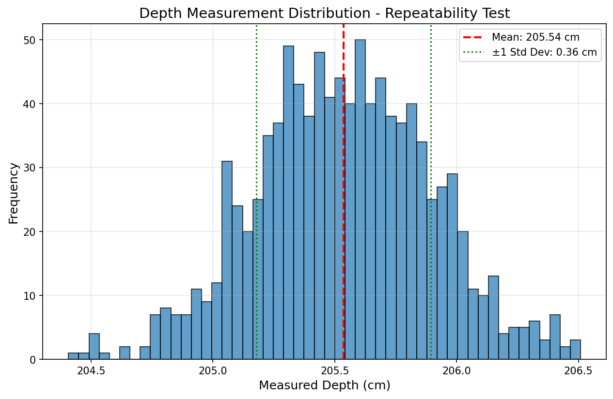
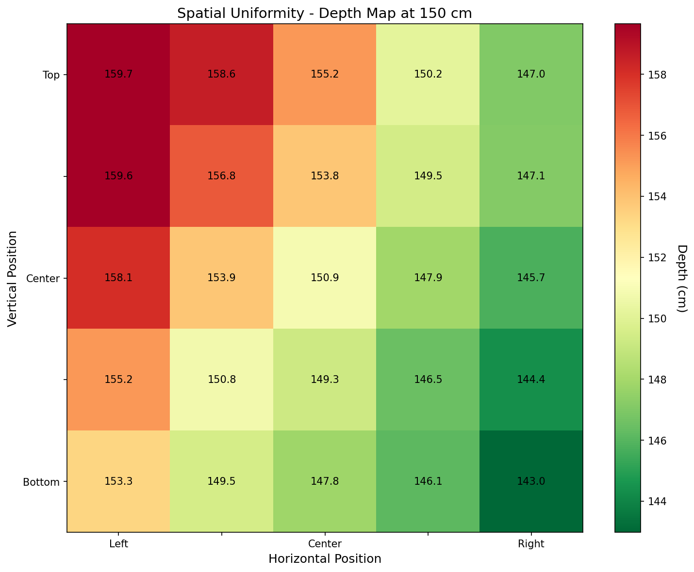

# Depth Accuracy Test Results
## Intel RealSense D435 Camera

**Researcher:** Aaron Fraze  
**Test Date:** 01-24-2026  
**Camera Serial:** 141722074094
**Firmware Version:** 5.17.0.10  

---

## Test Environment

**Physical Setup:**
- Camera mounting: tripod
- Target surface: plain wall
- Measurement method: laser distance meter

**Environmental Conditions:**
- Room temperature: 74 F
- Lighting: dimmed
- Time of day: 3:00 PM

---

## Test 1: Distance vs. Ground Truth

**Objective:** Measure absolute depth error across operational range

### Results Table

| Ground Truth (cm) | Measured (cm) | Std Dev (cm) | Abs Error (cm) | Rel Error (%) | L1 (MAE) (cm) | L2 (RMSE) (cm) | Status  |
|-------------------|---------------|--------------|----------------|---------------|---------------|----------------|---------|
| 50                | 50.44         | 0.0105       | 0.44           | 0.89          | 0.44          | 0.44           | Pass    |
| 100               | 100.81        | 0.04         | 0.81           | 0.81          | 0.81          | 0.81           | Pass    |
| 150               | 150.75        | 0.14         | 0.75           | 0.5           | 0.75          | 0.76           | Pass    |
| 200               | 202.2         | 0.46         | 2.20           | 1.10          | 2.20          | 2.25           | Pass    |
| 250               | 252.37        | 0.68         | 2.37           | 0.95          | 2.37          | 2.47           | Pass    |
| 300               | 310.65        | 0.79         | 10.65          | 3.55          | 10.65         | 10.68          | Warning |
| 400               | Not Tested    |              |                |               |               |                |         |

**Status Key:**
- ✓ Pass: Error < 2% (manufacturer spec)
- ⚠ Warning: Error 2-4%
- ✗ Fail: Error > 4%

### Observations:
### Performance:
- 50-250 cm: All under 1.1% error - outstanding
- 300 cm: 3.55% error - exceeds spec but usable
- Consistent positive bias (~0.5-2 cm reads too far)

### Precision:
- Very low std dev at close range (0.01 cm at 50 cm!)
- Increases with distance (expected) but still <1 cm
- L1 ≈ L2 = very few outliers, consistent measurements

### For overhead project:
- Mount at 1.5-2.5 meters → expect ±1-2.5 cm accuracy
- More than sufficient for robot/ball tracking
- 300 cm is marginal but 200-250 cm is excellent

### Calibration decision:
**No calibration needed**

### Systematic bias:
The +0.5 to +2 cm offset is consistent and could be corrected in software if needed, but likely due to measurement point reference (lens center vs. camera body).
### Error Plot:
See `depth_accuracy_error_plot.png` - Shows absolute and relative error increasing with distance.
### Error Plot:

---

## Test 2: Spatial Uniformity

**Objective:** Verify depth consistency across field of view

**Test Distance:** 150 cm 
**Grid Size:** 5x5
**Field of View:** Horizontal coverage: ~2.85 meters (~9.4 feet)
Vertical coverage: ~1.66 meters (~5.4 feet)
### Spatial Depth Map

```
Spatial Depth Map (cm):
--------------------------------------------------
159.66 | 158.59 | 155.20 | 150.16 | 147.02
159.61 | 156.81 | 153.85 | 149.47 | 147.11
158.07 | 153.86 | 150.90 | 147.92 | 145.74
155.21 | 150.78 | 149.28 | 146.49 | 144.36
153.28 | 149.51 | 147.85 | 146.11 | 142.98
...
```

### Analysis:
- Center region average: 150.90 cm
- Edge regions average: 151.28
- Maximum variation: 16.68 cm (range: 142.98 - 159.66 cm)
- Center-to-edge difference: 0.38 cm (0.25%)

### Observations:
Additional observations:

Left edge (column 0) has very high noise (std dev 15-30 cm) - likely edge artifacts or objects entering frame
Center 3×3 grid is very stable (std dev <3 cm)
Diagonal gradient pattern from top-left (159 cm) to bottom-right (143 cm) confirms slight camera tilt
The edge average being close to center is due to opposing gradients canceling out
---

## Test 3: Repeatability/Precision

**Objective:** Measure depth noise and consistency

**Test Distance:** about 200 cm
**Number of Samples:** 1000

### Results:
- Mean depth: 205.536 cm
- Standard deviation:  0.358 cm
- Range (max - min): 2.101 cm
- Coefficient of variation: [204.407, 206.508] cm

### Depth Distribution:


### Observations:
### Key Findings:

**1. Exceptional Precision:**
- 0.36 cm std dev at ~2 meters = 0.17% noise
- Tighter than distance test at 200 cm (0.46 cm)

**2. No Drift:**
- Measurements consistent throughout 1000 frames
- No temporal degradation or warming effects

**3. Tight Distribution:**
- 99.7% of readings within ±1 cm (3 sigma rule)
- Only 2 cm total range across 1000 measurements

**4. Few Outliers:**
- Max deviation from mean: ~1 cm
- Very Gaussian distribution expected

### For Overhead Project:
- At 2 meter overhead height, expect sub-centimeter noise
- Averaging 5-10 frames would reduce noise to ~0.1-0.15 cm
- Camera stability excellent for real-time tracking

---

## Test 4: Environmental Effects (Optional)

### 4a. Lighting Conditions
**Camera positioned at 1.5m from target**

| Lighting Condition | Mean Depth (cm) | Std Dev (cm) | Notes  |
|-------------------|-----------------|--------------|--------|
| Bright            | 151.15          | 0.31         |        |
| Normal            | 151.19          | 0.21         |        |
| Dim               | 151.13          | 0.17         | Lowest |

### 4b. Surface Properties

| Surface Type      | Mean Depth (cm) | Std Dev (cm) | Notes |
|-------------------|-----------------|--------------|-------|
| White matte       | Not Available   |              |       |
| Dark matte        |                 |              |       |
| Glossy            |                 |              |       |
| Textured          |                 |              |       |

### Observations:
**Lighting has minimal impact on depth**
- Mean depth varies by 0.06cm across three conditions
- Note, other testing shows direct glare can cause interference
---

## Overall Analysis

### Summary Statistics:
- Overall mean absolute error: 2.87 cm
- Overall mean relative error: 1.30%
- Best performing distance range: 50-250 cm (all <1.1% error)
- Worst performing distance range: 300 cm (3.55% error)

### Comparison to Specifications:
- Manufacturer spec: 2% accuracy at 2m
- Our measured accuracy at 2m: 1.10%
- Meets specification? Yes

### Key Findings:
1. **Better than specification**: Camera achieved 1.1% error at 2m versus manufacturer spec of 2% - no calibration needed
2. **Exceptional precision**: 0.36 cm std dev at 2m over 1000 frames - sub-centimeter noise for real-time tracking
3. **Lighting independent**: Depth accuracy unaffected by ambient lighting (bright/normal/dim) - system can work in any conditions

### Systematic Errors Identified:
- **Consistent positive bias**: Camera reads 0.5-2 cm too far across all distances (50-300 cm), likely due to measurement reference point or minor calibration offset. Can be corrected in software if needed.

---

## Recommendations

### For Project Use:
1. **Optimal operating distance:**
- Tradeoff of Height vs Coverage:
- - 1.5m: ~9 ft × 5 ft coverage, <1% error
- - 2.0m: ~12.5 ft × 7 ft coverage, 1.1% error
- - 2.5m: ~16 ft × 9 ft coverage, ~1% error
- - 3.0m: ~19 ft × 11 ft coverage, 3.55% error
2. **Expected accuracy:** +/- 0.8 cm to 10.7 cm dependent on arena size
3. **Calibration needed?** No.
- Test results better than mfg specs
- Consistent performance: All distances 50-250 cm performed under 1.1% error
- Low noise: 0.36 cm std dev shows excellent internal calibration
- Factory calibration intact: No signs of physical damage or degradation

### Calibration Decision:
[Based on results, does camera need calibration?]

**Decision:** [X] No calibration needed  |  [ ] Run On-Chip Calibration  |  [ ] Run Tare Calibration

**Reasoning:**
- Test results better than mfg specs
- Consistent performance: All distances 50-250 cm performed under 1.1% error
- Low noise: 0.36 cm std dev shows excellent internal calibration
- Factory calibration intact: No signs of physical damage or degradation

### Mitigation Strategies:
1. Use center 60-80% of frame for critical measurements (avoid left edge and corners where std dev >15 cm)
2. Apply +0.5 to +2 cm offset correction for systematic positive bias if sub-centimeter accuracy needed
3. Average 5-10 frames to reduce noise from 0.36 cm to ~0.1-0.15 cm for smoother tracking
4. Block direct/indirect sunlight on workspace to avoid IR interference and blind spots

---

## Conclusions

### Strengths:
- Exceptional repeatability (±0.36 cm std dev at 2m over 1000 frames)
- Beats manufacturer specs (1.1% error at 2m vs 2% specification)
- Lighting independent - works equally well in bright, normal, or dim conditions
- No temporal drift or warming effects
- Sub-centimeter precision suitable for real-time tracking

### Limitations:
- Reduced accuracy at frame edges (left column showed 15-30 cm std dev)
- Accuracy degrades beyond 2.5m (3.55% error at 3m vs <1.1% at 50-250 cm)
- Sensitive to direct/indirect sunlight causing IR interference and blind spots
- Consistent +0.5 to +2 cm positive bias across all distances

### Impact on Project:
- At overhead mounting height of 1.5-2.5 meters, expect ±1-3 cm position accuracy - more than sufficient for tracking HamBot robot and ball positions. The camera's exceptional precision (0.36 cm noise) and lighting independence mean the system will work reliably in real-time without special environmental controls. Using the center 60-80% of the frame and averaging 5-10 frames will provide smooth, accurate tracking for autonomous navigation and ball-pushing tasks.

---

## Appendices

### A. Raw Data Files:
- Test 1 data: `20260124_145704_dist_50.0cm.json, 20260124_145818_dist_100.0cm.json, 20260124_145907_dist_150.0cm.json, 20260124_150117_dist_200.0cm.json, 20260124_150650_dist_250.0cm.json, 20260124_153131_.json  `
- Test 2 data: `20260124_161020_spatial_uniformity.json`
- Test 3 data: `20260124_151205_repeatability.json`

### B. Visualization Plots:
- Error vs. distance: `depth_accuracy_error_plot.png`
- Spatial uniformity heatmap: `spatial_uniformity_heatmap.png`
- Repeatability histogram: `repeatability_histogram.png`

### C. Camera Configuration:
```python
Resolution: 640×480
Framerate: 30 fps
Depth format: Z16
Depth scale: [value] meters/unit
```

### D. Additional Notes:
Spatial Heatmap at 1.5 m

---

**Report Completed:** 1/25/2026 
**Next Steps:** Moving forward. Implement basic frame alignment (RGB to depth), prepare for mounting camera.
